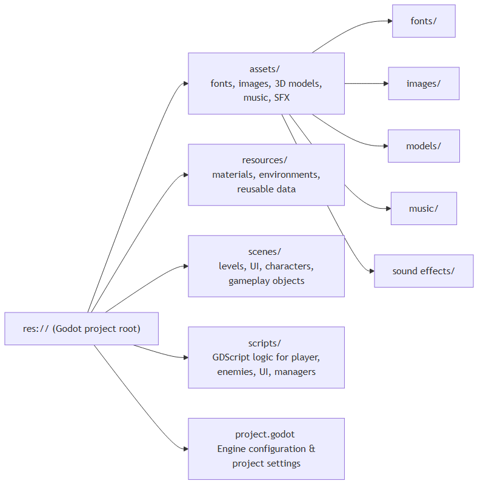

# 🏞️ 3D Platformer

A 3D-platformer game built with **Godot Engine**. Run, jump, and explore a vibrant world while collecting coins and defeating enemies in this classic 3D platforming experience!


---

## 📋 Table of Contents

* [Features](#-features)
* [Gameplay](#-gameplay)
* [Requirements](#-requirements)
* [Installation](#-installation)
* [How to Play](#-how-to-play)
* [Project Structure](#-project-structure)
* [Assets & Credits](#-assets--credits)
* [License](#-license)

---

## ✨ Features

* **Classic Platforming Gameplay** – Run, jump, and explore 3D levels
* **Coin Collection and Enemy Encounters** – Collect coins and defeat enemies to win
* **Responsive Controls** – Smooth character movement and jumping
* **Screenshot Utility** – Capture your best moments with a single keystroke.
* **Open Source** – GPL-3.0 licensed, free to modify and distribute

---

# 📸 Screenshots

### Gameplay


---

## 🎮 Gameplay

### Controls

| Action                      | Input                |
| --------------------------- | -------------------- |
| **Move Forward**            | `W` or `↑` Arrow Key |
| **Move Backward**           | `S` or `↓` Arrow Key |
| **Move Left**               | `A` or `←` Arrow Key |
| **Move Right**              | `D` or `→` Arrow Key |
| **Jump**                    | `Spacebar` or `Enter`|
| **Rotate Camera Left**      | `Num1`               |
| **Rotate Camera Right**     | `Num2`               |
| **Take Screenshot**         | `B`               |

> [IMPORTANT]
> **To use the Screenshot feature:** You must define your preferred save path in the global script located at `scripts/global.gd` before the images can be saved to your local drive. MAKE SURE YOU DEFINE A PATH BEFORE STARTING THE GAME OR IT WILL NOT RUN !!!

### Objective

Collect the required number of coins and/or defeat the required number of enemies to complete each level. Avoid hazards and explore the environment to find all collectibles.

---

## 📦 Requirements

* **Godot Engine**: v4.0 or newer
* **Operating System**: Windows, macOS, or Linux
* **RAM**: Minimum 2GB (recommended 4GB+)

---

## 🔧 Installation

### 1. Clone the Repository

```bash
git clone https://github.com/SarthakBharad-Godot/3d-platformer.git
cd 3d-platformer
```

### 2. Open in Godot

1. Download and install [Godot Engine v4.x](https://godotengine.org/download)
2. Open Godot Project Manager
3. Click **Import** and navigate to the cloned folder
4. Select the `project.godot` file and open the project

### 3. Run the Game

* Press the **Play** button (▶) or `F5` to start the game
* Press `F8` for windowed gameplay (optional)

---

## 🎯 How to Play

1. **Start the Game** – Run the project in Godot or from a compiled build
2. **Move Your Character** – Use WASD or Arrow Keys to navigate
3. **Jump and Explore** – Avoid hazards and reach higher platforms
4. **Collect Coins** – Pick up coins to progress towards the level goal
5. **Defeat Enemies** – Eliminate enemies blocking your path
6. **Complete Level** – Reach the coin/enemy objective to win

---

## 📁 Project Structure


```
res://
├── assets/                 # Game assets such as fonts, images, models, music, and sound effects
│   ├── fonts/             
│   ├── images/            
│   ├── models/            
│   ├── music/             
│   └── sound effects/     
├── resources/              # Godot resource files
│   ├── environment.tres
│   └── world_blocks.tres
├── scenes/                 # Godot scene files (.tscn)
│   ├── character.tscn
│   ├── coin.tscn
│   ├── enemy.tscn
│   ├── gameover.tscn
│   ├── hud.tscn
│   ├── level_one.tscn
│   ├── menu.tscn
│   ├── platform.tscn
│   ├── sound_manager.tscn
│   └── win.tscn
├── scripts/                # GDScript files (.gd)
│   ├── character.gd
│   ├── coin.gd
│   ├── enemy.gd
│   ├── gameover.gd
│   ├── global.gd
│   ├── hud.gd
│   ├── level_one.gd
│   ├── menu.gd
│   ├── platform.gd
│   ├── sound_manager.gd
│   └── win.gd
├── project.godot           # Godot project configuration
├── icon.svg                # Project icon
└── README.md               # This file
```

---

## 🎨 Assets & Credits

This project uses the following assets and resources:

* **Robot** – [Blendswap Robot Model](https://www.blendswap.com/blend/17408)
* **Coin** – [BlenderKit Coin](https://www.blenderkit.com/get-blenderkit/4bc61082-f985-4753-85f3-07748d043fa3/)
* **World Blocks** – Custom-made, with roughness and tiles sourced from [AmbientCG Tiles138](https://ambientcg.com/view?id=Tiles138)
* **Enemies** – [Quaternius Ultimate Platformer Pack](https://quaternius.com/packs/ultimateplatformer.html)
* **Audio** – Free sound effects from [Pixabay](https://pixabay.com/sound-effects/search/game/) and [Kenney.nl](https://kenney.nl/assets/category:Audio)

### Asset Customization

Feel free to modify, mix, and create your own versions of these assets.


---

## 🛠️ Development

### Build & Export

To create a standalone executable:

1. Go to **Project → Export...**
2. Create a new export template for your OS
3. Configure settings and click **Export**

For detailed export instructions, see the [Godot Documentation](https://docs.godotengine.org/en/stable/getting_started/introduction/first_3d_game.html).

### Extending the Game

You can extend this game by adding:

* New levels and environments
* Power-ups and upgrades
* Enhanced enemy AI
* Leaderboards and scoring systems
* Soundtracks and additional effects

---

## 📜 License

This project is licensed under the **GNU General Public License v3.0** (GPL-3.0). See the [LICENSE](LICENSE) file for details.

You are free to:

* ✅ Use this project commercially or personally
* ✅ Modify and distribute the code
* ✅ Create derivative works

With the condition that:

* 📋 You must include the original license and copyright notice
* 📖 Derivatives must also be licensed under GPL-3.0

---

## 🤝 Contributing

Found a bug? Have an idea for improvement? Contributions are welcome!

1. Fork this repository
2. Create a feature branch (`git checkout -b feature/amazing-feature`)
3. Commit your changes (`git commit -m 'Add amazing feature'`)
4. Push to the branch (`git push origin feature/amazing-feature`)
5. Open a Pull Request

---

## 💬 Questions or Feedback?

If you have suggestions, questions, or encounter issues:

* Open an [Issue](https://github.com/SarthakBharad-Godot/3d-platformer/issues) on GitHub
* Feel free to fork and experiment!

---

## 📚 Useful Resources

* [Godot Engine Documentation](https://docs.godotengine.org)
* [GDScript Language Reference](https://docs.godotengine.org/en/stable/getting_started/scripting/gdscript/index.html)
* [Kenney Assets](https://kenney.nl)
---

**Enjoy the game! Happy coding! 🎮✨**
